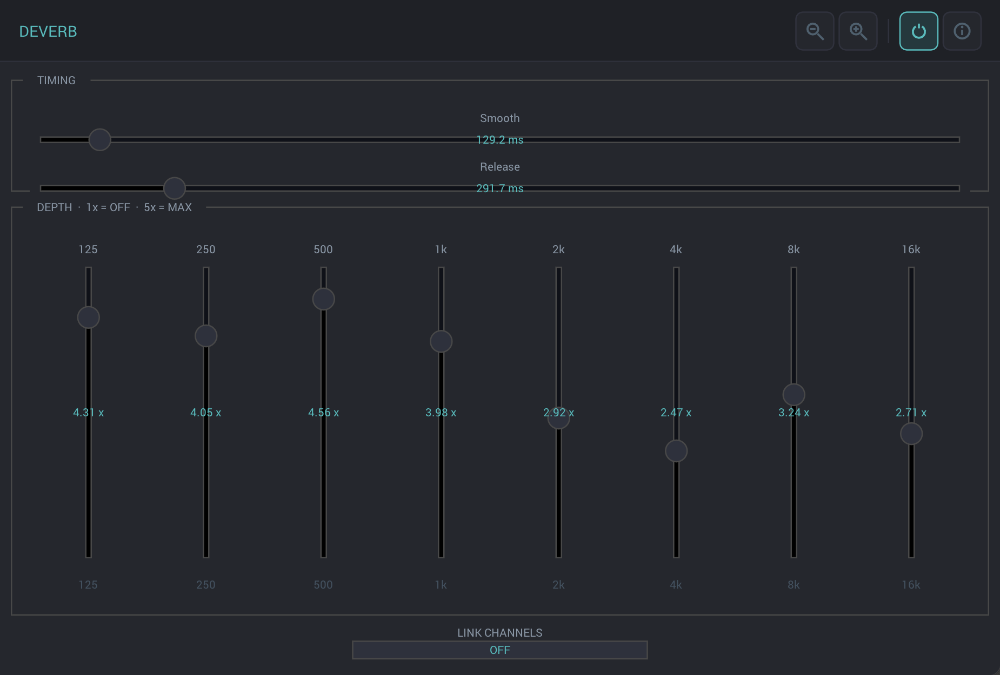

# Deverb
Audio plugin created using iPlug2 and the deverb code from postfish https://github.com/ePirat/Postfish 

I've been wanting to get around to pulling this deverb code from Xiph's postfish codebase for years. Recently started using Claude Code, and for a test I thought I'd try and see if CC can do the merge for me.

After a false start using JUCE I switched to iPlug2 and tried to create the plugin again. After a few debugging sessions it started working. I got Claude to create a simple gui, some icons and compiled it up for my intel mac. It works, not completely transparent but it does remove wetness from the signal.

Compile up and use at your own risk, at some point I'll add some github actions to build it cross platform. Although the standalone app compiles I haven't worked on it much. The VST does work for me

It has a dependency on the fftw3 library https://github.com/FFTW/fftw3 which I installed using homebrew

- Spen
